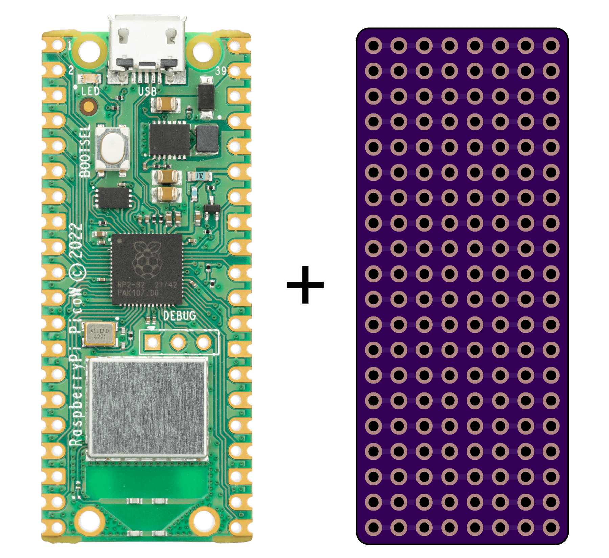

# Raspberry Pi Pico Stripboard

A stripboard PCB designed for the Raspberry Pi Pico. Compatible with Pico W also.

## Features

- Neatly sized to fit the Pico family of boards
- Reversible design—flip it any way you need
- Large ground plane

## Purpose

Use this stripboard to permanently solder through-hole components to a Raspberry Pi Pico, designed for tidy, complete projects that don't need a custom PCB. Unlike protoboards, the footprint of this stripboard matches the Pico's within a couple tenths of a millimeter.

The stripboard has a breadboard-like layout of horizontal rows of holes connected to each other. Both the left and right sides have four holes per row, each. This allows up to three components to be soldered to each pin of the Pico. The rows connected to ground are an exception. Because the Pico's ground pins are mirrored on the left and right sides, the rows connected to ground are connected all the way across the stripboard.

Aside from the ground rows, the traces between holes in the same row can be drilled or scratched out to separate the holes if needed.
